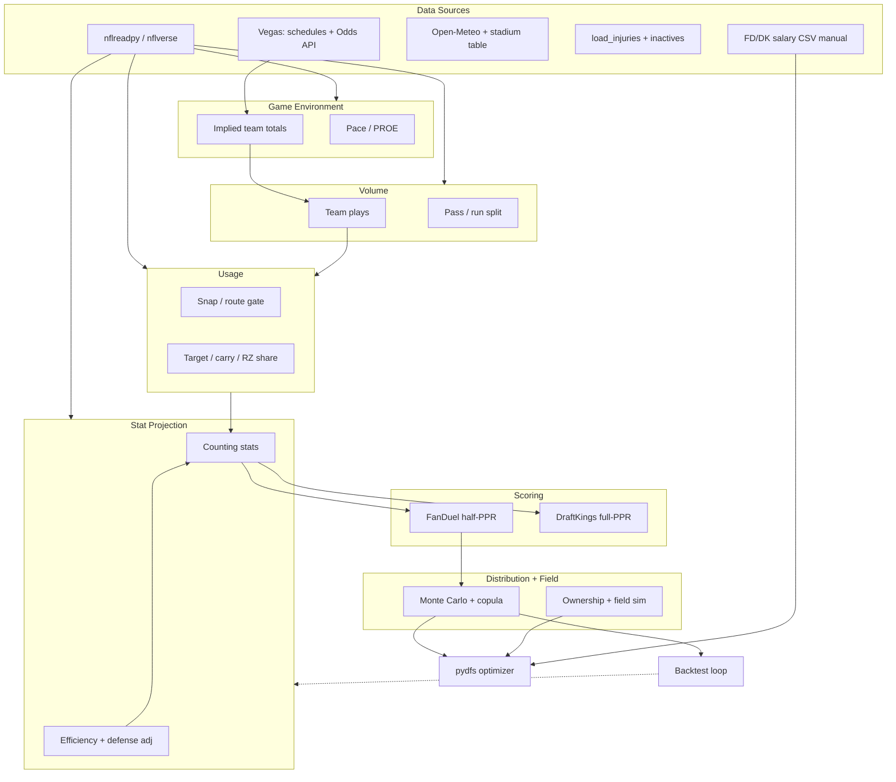

## Relations

- @sources/research-diy-dfs-model-master-plan-2026-06-20.md — K125 master plan (18 workstreams · 38 subagents)
- @sources/cross-wiki-k125-diy-dfs-sweep-2026-06-20.md — sibling-wiki weather/orchestration inventory
- @osint-wiki/concepts/nfl-coherence-risk-features.md — K126 ClarusC64 coherence-risk feature suite (stage-2 extensions)
- @concepts/dfs-paid-tool-methodologies.md — paid benchmark reference
- @entities/tools/ceminidfs.md — implementation repo (K125/W9)
- @entities/tools/pydfs-lineup-optimizer.md — lineup generation downstream
- @concepts/diy-nfl-pickem-props-tool-architecture.md — sibling K147 pick'em tool (shares projection layers only)
- @sources/research-diy-pickem-props-master-plan-2026-07-05.md — K147 master plan (14 workstreams)

## Raw Concept

From-scratch **NFL DFS projection pipeline** (FanDuel-primary) feeding pydfs optimizer. **Implementation repo:** [github.com/cemini23/CeminiDFS](https://github.com/cemini23/CeminiDFS). Stokastic/FantasyLabs = **accuracy benchmark only**. Research completed K125 (2026-06-20).

## Narrative

### Goal

Emit normalized per-player CSV (median + optional ceiling/floor/ownership) → existing pydfs FanDuel optimizer. Every modeling choice backtest-justified; every data source license-cleared.

### Layer diagram

### Layer pages (K125)

| Layer | Page | Status |
|-------|------|--------|
| Data + legal | @concepts/nfl-dfs-data-sources.md | draft |
| FOSS stack | @concepts/dfs-foss-tooling-landscape.md | draft |
| Implied totals | @concepts/implied-team-totals-dfs.md | draft |
| Volume / pace | @concepts/team-volume-pace-model.md | draft |
| Usage | @concepts/player-usage-models.md | draft |
| Stat engine | @concepts/dfs-stat-projection-engine.md | draft |
| Scoring | @concepts/fd-dk-scoring-conversion.md | draft |
| Distribution | @concepts/dfs-distribution-layer.md | draft |
| Correlation | @concepts/dfs-correlation-stacking.md | draft |
| Ownership | @concepts/dfs-ownership-projection.md | draft |
| Weather | @concepts/dfs-weather-adjustments.md | draft |
| Injury / news | @concepts/dfs-injury-and-news-workflow.md | draft |
| Backtest | @concepts/dfs-backtesting-framework.md | draft |
| Integration | @concepts/dfs-pipeline-integration-spec.md | draft |
| Orchestration | @concepts/dfs-model-orchestration.md | draft |
| Paid methods | @concepts/dfs-paid-tool-methodologies.md | draft |

### Build vs borrow (summary)

| Component | Verdict |
|-----------|---------|
| Data backbone | **Borrow** nflreadpy |
| Vegas history | **Borrow** load_schedules |
| Vegas live | **Borrow** The Odds API (CONDITIONAL quota) |
| Optimizer | **Borrow** pydfs (MIT) |
| Projections v1 | **Build** stat-first regression |
| Ownership | **Build** (FantasyLabs labels for train) |
| Contest sim | **Build** v2; chanzer0 = ideas only |
| Salaries | **Manual** FD/DK export |

### Implementation backlog (ROADMAP K125)

1. `normalize_dfs_projection_csv.py` — `--site`, DK path, extra columns
2. `dfs_slate_optimize.py` — generalize from FD-only
3. `nfl_dfs_weekly_run.py` — orchestrator + manifest
4. `fanduel_late_swap_optimize.py` — W-NEWS path
5. `scripts/dfs_backtest.py` — walk-forward harness [future]

### Cross-wiki resources (K125 sweep 2026-06-20)

Full matrix: @sources/cross-wiki-k125-diy-dfs-sweep-2026-06-20.md

| Need | Primary wiki | Key pages |
|------|--------------|-----------|
| Weather APIs | **@osint-wiki** | open-meteo, nws-weather-gov, visualcrossing, wethr-net, ensemble-weather-forecasting |
| API keys / limits | **@osint-wiki** | api-credential-registry |
| Pipeline DAG | **@ccc-wiki** | plan-then-execute-topological-orchestration, scatter-gather |
| CLV / sharp benchmark | **@gambling-wiki** | line-shopping-and-clv |
| Bankroll / Kelly | **@gambling-wiki** | bankroll-management, kelly-criterion-betting |
| Multi-book signals | both | momentum-odds (gambling stub ↔ osint deep page) |
| Raw archive | both | cemini-egress-fi (osint) = gambling CLAUDE.md archive path |

## Snippets

> "18 workstreams · 38 subagents · 6 execution waves." [Source: @sources/research-diy-dfs-model-master-plan-2026-06-20.md]
