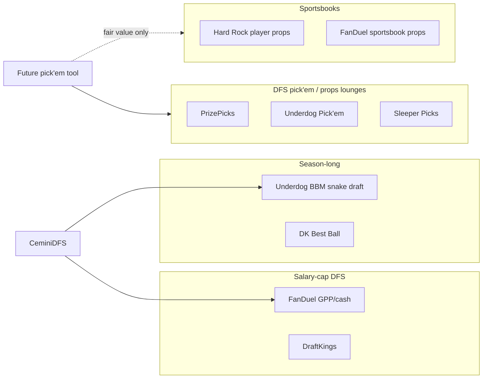
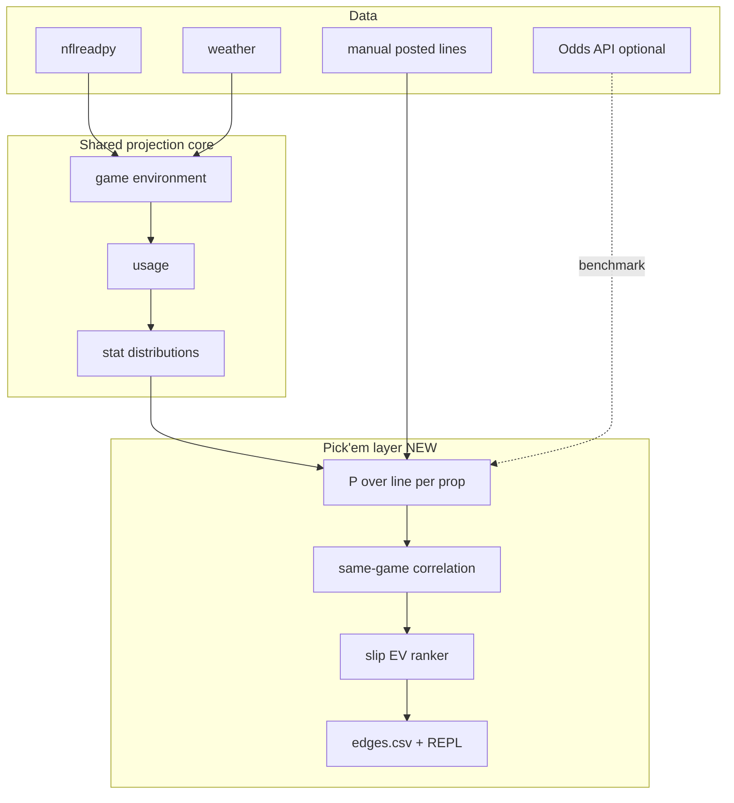

## Relations

- @concepts/pickem-stat-type-mapping.md — W-STAT-MAP (SA-07)
- @concepts/pickem-data-sources.md — W-DATA (SA-08)
- @concepts/pickem-legal-and-tos-posture.md — W-LEGAL (SA-09)
- @concepts/pickem-backtesting-framework.md — W-BACKTEST (SA-10)
- @concepts/pickem-operator-workflow.md — W-WORKFLOW (SA-11)
- @concepts/pickem-pipeline-integration-spec.md — W-INTEG (SA-12)
- @concepts/diy-nfl-dfs-model-architecture.md — **sibling repo** (CeminiDFS); shares nflverse + game-environment layer only
- @entities/tools/ceminidfs.md — implementation boundary: **no pick'em code in CeminiDFS** (07-05 triage)
- @sources/fantasylabs-picklabs-launch-2026-07-05.md — paid-tool landscape signal (PickLabs)
- @entities/sports/nfl-betting.md — sportsbook player props lane (Hard Rock W8)
- @sources/sharp-nfl-rb-prop-unders-2026-08-13.md — season-long RB unders as volume-share template
- @concepts/parlay-and-correlated-bets.md — pick'em slips are correlated multi-leg portfolios
- @concepts/pickem-payout-and-breakeven.md — W-PAYOUT implied prob + breakeven tables
- @concepts/pickem-fair-probability.md — W-FAIR-PROB `P(stat > line)` marginals
- @concepts/pickem-slip-ev-and-correlation.md — W-SLIP-EV / W-KELLY joint EV ranker
- @sources/research-diy-pickem-props-master-plan-2026-07-05.md — K147 master plan (14 workstreams · 14 subagents · 4 waves)

## Raw Concept

**Research hub** for a future **standalone** NFL props / DFS pick'em tool (tentative name: *CeminiPick* or operator choice). Binary O/U on posted stat lines across PrizePicks-style platforms — **not** salary-cap lineup optimization.

**Status:** Phase-0 research **~90%** (K147 master plan 2026-07-05). **Primary platform: Underdog Pick'em** (operator 2026-07-05 — already on app for BBM7). **PrizePicks Phase-2.** Repo spawn unblocked pending in-app geo check.

## Narrative

### Platform rollout (operator decision 2026-07-05)

| Phase | Platform | Rationale |
|-------|----------|-----------|
| **MVP (Phase-1)** | **Underdog Pick'em** | Account + payment already warm via BBM7; same app shell; slightly better 2–3 leg Standard payouts |
| **Phase-2** | **PrizePicks** | Add second payout profile (Power/Flex, demon/goblin); compare edges cross-lounge |
| **Benchmark** | Hard Rock / Odds API | CLV reference — not primary UX |
| **Defer** | Sleeper Picks | TBD |

**Build implication:** `config/payout_profiles/underdog.json` ships first; `prizepicks.json` follows. CLI default `--platform underdog`. User submits all slips manually on app — no auto-submit on either lounge.

### Why a separate repo (not CeminiDFS)

| Dimension | CeminiDFS (shipped) | Pick'em / props tool (proposed) |
|-----------|---------------------|----------------------------------|
| Decision unit | 9-player lineup under salary cap | 2–6 leg O/U slip on one stat each |
| Optimization | pydfs + ownership leverage | Fair P(over) vs posted line + parlay correlation |
| Platform integration | FanDuel CSV + Underdog BBM extension | PrizePicks / UD Pick'em / Sleeper — **no licensed API** |
| Bankroll math | GPP min-cash / top-1% | Flex/power payouts, demon/goblin multipliers, push rules |
| Legal posture | Manual CSV, no scrapers | Same — **scrapers remain NO-GO** |

CeminiDFS ROADMAP explicitly closed PickLabs adoption (07-05). Strategy and platform research live here; code ships in a **new repo** only after gates below pass.

### Product taxonomy (do not conflate)

| Lane | Operator W8? | This tool targets? |
|------|--------------|-------------------|
| FanDuel DFS GPP | Yes | **No** — CeminiDFS |
| Underdog BBM VII | Yes | **No** — CeminiDFS `bbm` |
| Hard Rock NFL props | Yes | **Benchmark / CLV** — not primary UX |
| PrizePicks / UD Pick'em | TBD | **UD primary (MVP)** · PP Phase-2 — @entities/platforms/underdog-pickem.md |

### What transfers from CeminiDFS (reuse map)

| Layer | CeminiDFS module | Pick'em reuse | Notes |
|-------|------------------|---------------|-------|
| PBP / rosters | nflreadpy fetch | **Copy pattern** | Same canonical data path |
| Game environment | ITT, pace, weather | **Direct** | Drives team pass rate → QB yards, game script |
| Usage | target/carry shares | **Direct** | Reception / rush attempt props |
| Stat projection | counting stats | **Direct** | Median → distribution for P(over line) |
| Distribution | Monte Carlo / copula | **Adapt** | Need per-stat marginals + **same-game correlation** for 2-leg slips |
| Scoring | FD half-PPR | **Discard** | Pick'em uses raw yards, TDs, combos — site-specific |
| Ownership | field sim | **Discard** | Irrelevant to pick'em |
| Optimizer | pydfs | **Discard** | Replace with edge ranker + Kelly on slip EV |
| Extension | BBM copilot MV3 | **New build** | Different DOM, different ToS surface |

**Minimal viable borrow:** export `ceminidfs project` player stat distributions (or a thin shared `cemini-nfl-core` package later) — **do not** fork the full repo on day one.

### Core math (tool must implement)

1. **Fair probability:** `P(stat > line)` from projected distribution (not median vs line alone).
2. **Implied probability:** reverse posted American odds or pick'em payout table (platform-specific).
3. **Edge:** `fair_p - implied_p` after vig / house take.
4. **Slip EV:** for 2–6 legs, multiply **correlated** joint probability — not independent product. See @concepts/parlay-and-correlated-bets.md.
5. **Kelly:** fractional Kelly on **whole slip** — @concepts/kelly-criterion-betting.md.

### Platform research matrix (Phase-0)

Fill `[ ]` as research completes. **No code until row has license + export path or manual workflow.**

| Platform | Product | States / geo | Stat menu | Payout model | Data export | Scraper repos | Verdict |
|----------|---------|--------------|-----------|--------------|-------------|---------------|---------|
| Underdog | Pick'em (not BBM) | [ ] in-app | [x] | [x] | [x] manual | aidanhall21/underdog-fantasy-pickem-scraper — **NO LICENSE** | **PRIMARY (MVP)** → @entities/platforms/underdog-pickem.md |
| PrizePicks | Pick'em | [x] | [x] | Power / flex / demon-goblin | manual | GPL/no-license — **reject** | **Phase-2** → @entities/platforms/prizepicks.md |
| Sleeper | Picks | [ ] | [ ] | [ ] | [ ] | [ ] | **TBD** |
| Hard Rock | Sportsbook props | W8 primary | Full menu | Standard -110/-110 | Manual line log | N/A | **Benchmark only** |
| FantasyLabs PickLabs | Paid edge feed | All-Access SaaS (~$60+/mo) | Props + pick'em; PP/UD/Sleeper + books | All-Access bundle | **None (UI)** — slip builder only | N/A | **Benchmark / hybrid** — @sources/fantasylabs-picklabs-launch-2026-07-05.md (validated SA-03) |

### Data posture (inherit from CeminiDFS + nfl-betting)

| Source | Role | Verdict |
|--------|------|---------|
| nflreadpy / nflverse | Usage + efficiency | **Primary** |
| The Odds API | Sportsbook prop lines (if subscribed) | **Borrow** — compare fair vs market |
| Open-Meteo + stadiums | Weather props (wind → passing) | **Borrow** |
| PrizePicks / UD posted lines | Target lines | **Manual entry or operator screenshot** — no scraper |
| PickLabs / BettingPros / Unabated | Benchmark accuracy | **Manual** — paid SaaS |
| Platform scrapers (no license) | — | **REJECT** — same as CeminiDFS K129 |

### Legal / ToS bar (non-negotiable)

Mirror CeminiDFS BBM extension posture:

- **OK:** local CLI fair-value calculator; read-only browser overlay; manual line entry; ledger for your own picks
- **NO-GO:** automated line scraping; auto-submit slips; credential stuffing; API intercept on mobile apps
- **REJECT repos:** `aidanhall21/underdog-fantasy-pickem-scraper`, `fantasydatapros/underdog` (no LICENSE — cited in CeminiDFS `docs/sleeper-sentiment-eval.md`)

### Phase-0 research checklist (gate before new repo)

**Product**

- [x] Pick primary platform — **Underdog Pick'em MVP**; PrizePicks Phase-2 (operator 2026-07-05, BBM7 account already active)
- [x] Document payout tables: 2-pick power, 3-pick flex, demon/goblin multipliers, pushes/Void rules — @entities/platforms/prizepicks.md, @entities/platforms/underdog-pickem.md, @concepts/pickem-payout-and-breakeven.md
- [x] Map stat types offered vs CeminiDFS projection outputs — @concepts/pickem-stat-type-mapping.md
- [x] Define operator workflow: pre-slate batch rank vs in-game live (live deferred) — @concepts/pickem-operator-workflow.md

**Data & backtest**

- [x] Historical prop line source — extend @sources/research-nfl-historical-odds-2026-06-20.md per @concepts/pickem-data-sources.md
- [x] Grading methodology: hit rate vs **CLV** vs closing line — @concepts/pickem-backtesting-framework.md
- [x] Minimum sample: 1 full NFL season walk-forward before trusting edge claims
- [x] Correlation calibration: same-game QB yards + WR yards joint hit rate — spec in backtest + @concepts/pickem-slip-ev-and-correlation.md

**Engineering**

- [ ] Repo name + MIT license + `pyproject.toml` skeleton — **ready to spawn**; default platform `underdog`
- [x] Shared package decision: copy-paste Phase-1 from CeminiDFS dist; `cemini-nfl-core` later — @concepts/pickem-pipeline-integration-spec.md
- [x] CLI shape: `prop-fair --player "Mahomes" --stat pass_yds --line 275.5` — @concepts/pickem-pipeline-integration-spec.md
- [x] Output: ranked edges CSV for operator manual entry on app
- [x] Extension: defer until CLI graded — @concepts/pickem-pipeline-integration-spec.md

**Economics**

- [x] Subscription budget: PickLabs vs build-yourself time — All-Access ~$60+/mo UI-only; **hybrid default** (SA-03)
- [x] Bankroll pool separate from DFS GPP and BBM entries — @concepts/pickem-operator-workflow.md, @concepts/bankroll-management.md
- [x] Expected hold / breakeven hit rate per slip type — @concepts/pickem-payout-and-breakeven.md, @concepts/vig-and-hold.md

### Proposed architecture (draft — unvalidated)

### Open questions (research backlog)

1. **Is DIY edge real on pick'em lounges?** House take on 2-leg power slips may exceed model error for retail — quantify breakeven.
2. **Correlation pricing:** do lounges misprice QB+WR same-game stacks enough vs independent legs?
3. **Injury latency:** pick'em lines move fast on OUT tags — same feed as @concepts/dfs-injury-and-news-workflow.md?
4. **NBA overlap:** PrizePicks is NBA-heavy — NFL-only tool or multi-sport later?
5. **Regulatory:** state pick'em classification vs sportsbook — operator geo checklist.

### Reading queue (from 2026-07-05 sweep)

| ID | Source | Action |
|----|--------|--------|
| R20 | [PickLabs launch (FantasyLabs, 2026-07-05)](https://www.fantasylabs.com/articles/picklabs-fantasylabs-new-tool-for-player-props-and-dfs-pickem-edges/) | **Done** — @sources/fantasylabs-picklabs-launch-2026-07-05.md (validated, SA-03) |
| R33 | [BettingPros Matt Moore prop example](https://www.bettingpros.com/nfl/props/matt-moore/rushing-receiving-yards/) | UI reference for combo props |
| — | @entities/tools/unabated.md, @entities/tools/odds-jam.md | Compare paid prop feeds vs DIY |

### Next brief (checklist ≥ 70% — platform locked)

Spawn **K147 implementation brief** in new repo folder (not CeminiDFS):

1. ~~Phase-0 platform decision~~ — **Underdog MVP**, PrizePicks Phase-2
2. `prop-fair` CLI MVP — `--platform underdog` default; UD Standard/Flex payout profile + shifted-multiplier handling
3. Walk-forward grader vs manual line log (UD lines first)
4. Phase-2: PrizePicks payout profile + demon/goblin line types
5. Optional Phase-3: read-only overlay — **Underdog pick'em lobby first** (separate DOM from BBM draft room)

Route morning-ingest hits tagged `pickem` / `player-props` to this page — not CeminiDFS ROADMAP.

## Snippets

> "Props/pick'em vertical (PrizePicks-style), not salary-cap NFL DFS." [Source: CeminiDFS `briefs/2026-07-05_research-triage-plan.md`]

> "aidanhall21/underdog-fantasy-pickem-scraper — NO LICENSE" [Source: CeminiDFS K129 eval]
