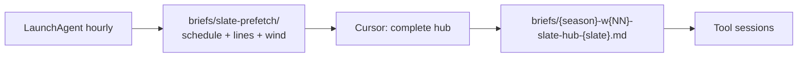
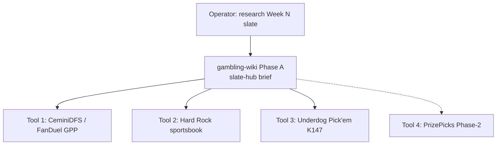

## Relations

- @meta/nfl-slate-prefetch-cadence.md — hourly LaunchAgent + prefetch stubs

- @entities/sports/nfl-betting.md — W8 four-lane operator stack
- @concepts/dfs-injury-and-news-workflow.md — shared T-90 injury cadence
- @entities/tools/ceminidfs.md — FanDuel GPP + BBM (pick'em **not** in repo)

## Raw Concept

**Research once, distribute many.** In **regular season**, operator requests per-slate hub research; in **Jul–Aug offseason**, use weekly camp research instead — @concepts/nfl-offseason-research-cadence.md (pick'em tool not required yet).

## Narrative

### Automation (prefetch → hub → tools)

Research is **per slate**, not once per calendar week — TNF, Sun main, SNF, and MNF can each get their own hub section or file.



| Tier | What | When |
|------|------|------|
| **1 — Prefetch** | `scripts/nfl_slate_prefetch_run.py` (cron/LaunchAgent) | **Early:** ~Sat eve for Sun 1pm, Wed for TNF, Sun eve for MNF · **Final:** ~T-90 before first kick |
| **2 — Hub** | You + Cursor in gambling-wiki | After notification or when `*-final.md` lands |
| **3 — Tools** | CeminiDFS, Hard Rock, Underdog pick'em | One session at a time, same hub |

Install: `bash scripts/install_nfl_slate_prefetch.sh` — see @meta/nfl-slate-prefetch-cadence.md.

**Slate keys:** `thu` · `sun` (main Sunday window) · `snf` · `mnf` — derived from nflverse kickoff times ET.

### Operator invoke (gambling-wiki session)

> "Research this week's NFL slate" / "W8 hub for Week {N}"

Agent runs **Phase A** below and writes `briefs/{season}-w{NN}-slate-hub.md`. Operator reviews hub with agent before opening tool repos.

### Two-phase cadence



**Rule:** Do not start tool sessions until hub brief exists (or operator explicitly skips a thin week).

### Phase A — Hub research (gambling-wiki only)

Pull **once** per **slate window** (not necessarily once per calendar week).

| Block | Contents | Feeds |
|-------|----------|-------|
| **Slate inventory** | Games, kickoffs, dome/outdoor, bye teams | All lanes |
| **Vegas environment** | Spread, total, implied team totals, line movement since open | DFS, book, pick'em |
| **Weather** | Wind, precip, temp — flag passing-game suppressors | DFS, book totals, pick'em pass props |
| **Injury / depth** | Q/D/O, backups, OL issues, inactive watch list | All lanes |
| **Game script notes** | Pace, PROE hints, blowout risk, key numbers (3/7) | DFS stacks, book sides, prop angles |
| **Narrative / news** | Beat reports, motivation, rest/travel | Tie-breakers only — no duplicate deep-read per tool |
| **Cross-lane flags** | e.g. "BUF wind → fade passing volume" | Copy into each tool brief § Shared context |

**Outputs**

- `briefs/{season}-w{NN}-slate-hub-{thu|sun|snf|mnf}.md` — one hub per slate (or merge sections in a single week file if preferred)
- Optional: append one-line pointer in `wiki/log.md` when hub is materially new

**Data sources (license-cleared):** nflverse schedules, Odds API (if key), Open-Meteo, official injury reports, wiki corpus — same bar as @concepts/nfl-dfs-data-sources.md. No platform scrapers.

### Phase B — Tool sessions (one at a time, with operator)

Launch **after** hub review. Each session gets: `@briefs/{season}-w{NN}-slate-hub.md` + tool wiki home + skill (if any).

| Order | Tool / repo | Wiki / skill entry | Hub sections consumed | Tool-specific only (do not redo in hub) |
|-------|-------------|-------------------|----------------------|----------------------------------------|
| 1 | **FanDuel GPP** | @entities/tools/ceminidfs.md · `.cursor/skills/nfl-fanduel-slate-prep/SKILL.md` | ITT, weather, injury, game script, stack candidates | FanDuel salary CSV, ownership, pydfs MME pools, exposure caps |
| 2 | **Hard Rock book** | @entities/platforms/hard-rock-bet.md · @concepts/line-shopping-and-clv.md | Spreads/totals/props angles, key numbers, injury | Current Hard Rock lines, promos, limits, CLV log entry |
| 3 | **Underdog Pick'em** | @concepts/diy-nfl-pickem-props-tool-architecture.md · @concepts/pickem-operator-workflow.md | Stat environment, injury, same-game stack ideas | Manual UD posted lines, shifted multipliers, slip build |
| 4 | **PrizePicks** (Phase-2) | @entities/platforms/prizepicks.md | Same as UD where stats overlap | PP lines, demon/goblin types, Power/Flex choice |

**Not weekly slate:** Underdog **BBM7** snake drafts — separate cadence (@concepts/bbm7-portfolio-construction.md). Hub injury block still useful during draft season.

**Invoke examples (tool sessions)**

- CeminiDFS folder: "Use hub brief for Week 7 — run projection + FanDuel MME lineups"
- gambling-wiki: "Hard Rock lane for Week 7 from hub — sides and props watchlist"
- K147 repo (when live): "Rank Underdog pick'em edges for Week 7; lines in `manual_lines.csv`"

### Hub brief template (minimum)

```markdown
# NFL Slate Hub — {season} Week {NN}
updated: {ISO date} · main slate: {Sun/SNF/MNF}

## Shared context (copy to all tools)
- Injury watch: ...
- Weather flags: ...
- ITT / totals table: ...

## Lane pointers
### FanDuel GPP
- Stack priorities: ...
- Fades: ...

### Hard Rock
- Spread/total lean: ...
- Prop theses: ...

### Underdog Pick'em
- Stat environment edges: ...
- Capture lines after: {time}

## Open questions (resolve before tool B)
- ...
```

### What stays central vs distributed

| Central (hub only) | Distributed (per tool) |
|--------------------|-------------------------|
| Schedule, weather, ITT, injury narrative | Platform lines and payouts |
| Game script / correlation themes | Optimizer constraints (salary, exposure) |
| One injury pass T-90 before main lock | Manual line capture (pick'em) |
| Key number context for sides | CLV log format per book |
| Cross-game priorities ("focus games") | Entry sizing per bankroll pool |

### Season rhythm

| When | Hub scope |
|------|-----------|
| Tue–Thu | Early hub — lines soft, injury speculative; revise before Sun |
| Sat | Hub refresh — practice reports, weather firming |
| Sun T-90 | Final hub delta — inactives, late scratches |
| SNF / MNF | Mini-hub section or separate `slate-hub-snf.md` |

### Agent operating rules (gambling-wiki)

1. **Read** `wiki/index.md` → hub-related pages → prior week hub if exists
2. **Produce** hub brief before suggesting tool commands
3. **Do not** run pydfs or CeminiDFS CLI from gambling-wiki unless operator explicitly wants a single-folder session
4. **Route** pick'em/props ingest to K147 pages — not CeminiDFS ROADMAP
5. **End hub session** with: suggested tool order + what's still tool-specific

## Snippets

> "Research once here centrally then distribute to each tool." [Source: operator workflow spec, 2026-07-05]

> "Same injury and game-environment research feeds all four" lanes. [Source: @entities/sports/nfl-betting.md W8 stack table]
